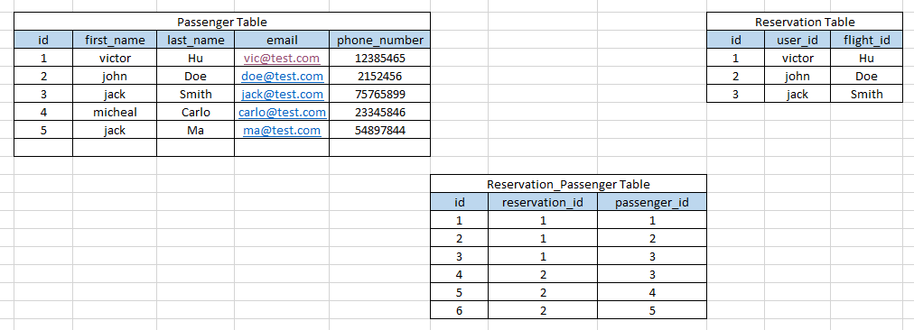

## TASLAK_V01

### Django proje kurulumu:

```py
- python -m venv env
- ./env/Scripts/activate 
- pip install djangorestframework
- pip install python-decouple
- pip freeze > requirements.txt
- django-admin startproject core .
- python manage.py runserver 
```


### Repodan çektiğimiz bir projeyi requirements deki indirilen paket/versiyonları ile birlikte install etmek için kullanılacak komut ->
```py
- python -m venv env
- ./env/Scripts/activate 
- pip install -r requirements.txt
```

- .gitignore ve .env dosyalarını oluştur.
- settings.py daki SECRET_KEY ' i config ile .env ye ekle

settings.py
```py
from decouple import config
SECRET_KEY = config('SECRET_KEY')
```

.env
```py
SECRET_KEY =django-insecure-&2_9wl^*c1v&z-x0g121-qceca2nm&tys+=a_!$9(6x28vech&
```


- superuser oluştur ->

```powershell
- python manage.py createsuperuser
- python manage.py runserver
```


- Add "rest_framework" to your INSTALLED_APPS setting -> 

settings.py ->

```py
INSTALLED_APPS = [
    'django.contrib.staticfiles',
    # 3rd party packages
    'rest_framework',
]
```


### Install Swagger

- Dokümantasyon için kullanılır, backend de oluşturduğumuz endpointlerin daha doğrusu API nin dokümantasyonu.
- Swagger, 2010 yılında bir girişim tarafından başlatılan açık kaynaklı bir projedir. Amaç, bir framework uygulamaktır.kod ile senkronizasyonu korurken, geliştiricilerin API'leri belgelemesine ve tasarlamasına olanak sağlamaktır.
- Bir API geliştirmek, düzenli ve anlaşılır dokümantasyon gerektirir.
- API'leri Django rest frameworküyle belgelemek ve tasarlamak için gerçek oluşturan drf-yasg kullanacağız.
Bir Django Rest Framework API'sinden Swagger/Open-API 2.0 belirtimleri. belgeler burada bulabilirsin

- drf-yasg -> django rest_framework yet another swagger generator

- installation

```powershell
- pip install drf-yasg
- pip freeze > requirements.txt
```

- add drf-yasg to INSTALLED_APPS -> 'drf_yasg'

- swagger için güncellenmiş urls.py aşağıdaki gibidir. Swagger belgelerinde, bu modeller güncel değildir. urls.py'yi aşağıdaki gibi değiştiriyoruz.

urls.py ->

```py
from django.contrib import admin 
from django.urls import path 
 
# Three modules for swagger:
from rest_framework import permissions 
from drf_yasg.views import get_schema_view 
from drf_yasg import openapi 
 
schema_view = get_schema_view( 
    openapi.Info( 
        title="Flight Reservation API", 
        default_version="v1",
        description="Flight Reservation API project provides flight and reservation info", 
        terms_of_service="#", 
        contact=openapi.Contact(email="rafe@clarusway.com"),  # Change e-mail on this line! 
        license=openapi.License(name="BSD License"), 
    ), 
    public=True, 
    permission_classes=[permissions.AllowAny], 
) 
 
urlpatterns = [ 
    path("admin/", admin.site.urls), 
    # Url paths for swagger: 
    path("swagger(<format>\.json|\.yaml)", schema_view.without_ui(cache_timeout=0), name="schema-json"), 
    path("swagger/", schema_view.with_ui("swagger", cache_timeout=0), name="schema-swagger-ui"), 
    path("redoc/", schema_view.with_ui("redoc", cache_timeout=0), name="schema-redoc"), 
]
```


```powershell
- py manage.py runserver
- py manage.py migrate 
```

- swagger ı kurduk, urls.py daki ayarlarını da yaptık, http://127.0.0.1:8000/swagger/  endpointine istek attığımızda swagger ana sayfasını gördük.

### Install Debug Toolbar

- The Django Debug Toolbar is a configurable set of panels that display various debug information about the current request/response and when clicked, display more details about the panel’s content
  https://django-debug-toolbar.readthedocs.io/en/latest/
(Django Hata Ayıklama Araç Çubuğu, çeşitli hata ayıklama bilgilerini görüntüleyen yapılandırılabilir bir panel kümesidir. geçerli istek/yanıt ve tıklandığında panel içeriği hakkında daha fazla ayrıntı görüntüler)

- Install the package

```powershell
- pip install django-debug-toolbar
- pip freeze > requirements.txt
```

- Add "debug_toolbar" to your INSTALLED_APPS setting -> "debug_toolbar"

settings.py ->

```py
INSTALLED_APPS = [
    'django.contrib.staticfiles',
    # 3rd party packages
    # ....
    'debug_toolbar',
]
```

- Add django-debug-toolbar’s URLs to your project’s URLconf
 
urls.py ->
```py
from django.urls import path, include

urlpatterns = [ 
    # ... 
    path('__debug__/', include('debug_toolbar.urls')), 
] 
```

- Add the middleware to the top:

settings.py ->

```py
MIDDLEWARE = [ 
    "debug_toolbar.middleware.DebugToolbarMiddleware", 
    # ... 
] 
```

- Add configuration of internal IPs to "settings.py":

settings.py ->

```py
INTERNAL_IPS = [ 
    "127.0.0.1", 
]
```

- test edelim çalışacak mı?

```powershell
- py manage.py runserver
```

- çalıştı,   http://127.0.0.1:8000/   endpointine istek atınca gelen sayfanın sağ tarafında bir tool DjDT açılıyor.


- create superuser
```powershell
- py manage.py creaetsuperuser
```


### Seperate Dev and Prod Settings (Development ve Product ayarlarını ayırma)

- Şu ana kadar yaptığımız projelerde tüm projede geçerli olan ayarları settings.py altında topluyorduk. Ancak ideal bir ortamda çok tavsiye edilen bir durum değil. 
- Projenin bulunduğu safhaya göre settings.py ayarları değişeceği için, her ortam için ayrı bir settings.py oluşturulur. 
- Dokümanda görüldüğü gibi bir structure oluşturup, 

```text
settings/
    |- __init__.py
    |- base.py
    |- ci.py
    |- local.py
    |- staging.py
    |- production.py
    |- qa.py
```

    Yukarıdaki örnekteki gibi tek bir yerde hepsinin toplanmasından sa ayrı ayrı dosyalar oluşturup, mesela tüm projede geçerli olan ortak ayarları base.py içerisine almış, ci->Continuous integrations, qa->test gibi setting.py ı parçalara ayırıyoruz.
    
    Biz şuanda temel olarak hemen hemen her projede olan developer ve produc ortamını birbirinden ayıracağız.

- core klasörü içerisine settings klasörü create et, içerisine;
  - __init__.py  # burasının bir python package olduğunu gösterir
  - base.py   
  - development.py   
  - production.py   

- core içerisindeki settings.py içeriğini, yeni oluşturulan settings/base.py içerisine kopyalıyoruz.

- Artık settings.py dosyası silinebilir.

- Şimdi artık settings.py daki kodlarımızı ayırmaya başlıyoruz, ->

##### development settings ayarları ->

- development.py da olacak kodlar ->
  -  base.py dakileri import et, ve şu kodları ekle;
 
```py
from .base import *

THIRD_PARTY_APPS = ["debug_toolbar"] 
 
DEBUG = config("DEBUG") 
 
INSTALLED_APPS += THIRD_PARTY_APPS 
 
THIRD_PARTY_MIDDLEWARE = ["debug_toolbar.middleware.DebugToolbarMiddleware"] 
 
MIDDLEWARE += THIRD_PARTY_MIDDLEWARE 
 
# Database
# https://docs.djangoproject.com/en/4.0/ref/settings/#databases 
DATABASES = { 
    "default": { 
        "ENGINE": "django.db.backends.sqlite3", 
        "NAME": BASE_DIR / "db.sqlite3", 
    } 
} 
 
INTERNAL_IPS = [ 
    "127.0.0.1", 
]
```

  -  DEBUG = config("DEBUG") dediğimiz için base.py daki DEBUG kısmını siliyoruz/yoruma alıyoruz. Artık base.py da DEBUG yok, development.py a bakıyoruz orada diyor ki config den al bunu, config nereden alıyordu? .env den alıyordu, oraya gidip "DEBUG = True" ekliyoruz. DEBUG ı base den kaldırdık, artık development dayken config e bakacak orda ne yazıyorsa onu kullanacak.

  -  THIRD_PARTY_APPS = ["debug_toolbar"]  ı development.py a almış, o yüzden base.py daki INSTALLED_APPS deki debug_toolbar ı kaldırıyoruz. debug_toolbar ne zaman çalışacak? sadece developer dayken çalışacak.
  (INSTALLED_APPS += THIRD_PARTY_APPS komutu ile eklemiş.)
 
  -  debug_toolbar ı development.py a aldığımıza göre yine kendisi ile birlekte gelen middleware ı vardı yine onu da buraya alıyoruz ve base.py da yoruma alıyoruz.

  -  Default olarak djangoda sql3 kullanılıyordu, o da burada, o zaman base dekini yoruma/siliyoruz. Developer dayken sqlite kullan, onu da burada belirtiyorum.

  -  Yine INTERNAL_IPS i developer dayken kullan diyoruz ve base.py dan siliyoruz/yoruma alıyoruz.
  -  development ayarlarını ayırdık.

##### production settings ayarları ->

- Peki product halindeyken nasıl olacak? 
  - Aynı şekilde base.py daki herşeyi import et,

prod.py ->

```py
from .base import * 
 
DATABASES = { 
    "default": { 
        "ENGINE": "django.db.backends.postgresql_psycopg2", 
        "NAME": config("SQL_DATABASE"), 
        "USER": config("SQL_USER"), 
        "PASSWORD": config("SQL_PASSWORD"), 
        "HOST": config("SQL_HOST"), 
        "PORT": config("SQL_PORT"), 
        "ATOMIC_REQUESTS": True, 
    }
}
```
  
  - product ortamındayken şunu ilave et, bu ne? database. dev deyken sqlite idi, product ta iken bu! Burada ne var? PostgreSQL. Bağlantıyı yapacağız şimdi.
  
  - Buraya bakıyoruz yine configden kullandığı değişkenler var. Bu değişkenleri alıp .env file ımıza ekleyelim.
  
    SQL_DATABASE =  
    SQL_USER =
    SQL_PASSWORD =
    SQL_HOST = 
    SQL_PORT = 
  
  - Artık product taki postgresql server ın bağlantıyı kurabilmesi için gerekli parametreleri .env ye aldık. Şimdi bunları dolduralım. pgAdmin i çalıştırıyoruz, ve flight isminde bir db create ediyoruz, daha sonra .env deki değişkenleri create ettiğimiz db deki değişkenlerle update ediyoruz.
  
    SQL_DATABASE = flight
    SQL_USER = postgres
    SQL_PASSWORD = postgres
    SQL_HOST = localhost
    SQL_PORT = 5432
  
  - Böylelikle development da iken sqlite, product da iken postgresql kullanmasını söyledik.


### PostgreSQL setup

- To get Python working with Postgres, you will need to install the “psycopg2” module.
(Python'un Postgres ile çalışmasını sağlamak için “psycopg2” modülünü kurmanız gerekecek.)

```powershell
- pip install psycopg2
- pip install psycopg2-binary # for macOS
- pip freeze > requirements.txt
```


- Biz prod ve dev diye ayırdık ama bunlardan hangisini kullanacağını nasıl bilecek?

##### __init__.py settings ayarları ->

- Onun için settings/ __init__.py file ına;

```py
from .base import * 


env_name = config("ENV_NAME") 
 
if env_name == "prod": 
 
    from .prod import * 
 
elif env_name == "dev": 
 
    from .dev import *
```

- kodları yazıyoruz. Burada ne demek istiyoruz? 
  - base.py dan herşeyi al, 
  - eğer config deki ENV_NAME i production ise from .production import * bunu ekle, 
  - değil config deki ENV_NAME i development ise from .development import * bunu ekle diyoruz.
  - Ancak config içindeki ENV_NAME i alıp .env file içinde "ENV_NAME = production" olarak ekliyoruz.
  - Artık init.py dosyamız ENV_NAME i config den production (burayı development/production olarak manuel değiştirebiliriz.) olarak alıyor, madem production o zaman, "from .base import *"  bunu zaten almıştı bir de  "from .production import *" bunu çalıştır diyoruz.


- Şimdi biz daha önce bir migrate yapmıştık ama o sqlite içindi. Artık yeni bir db ye bağladığımız için yine bir migrate yapacağız. 

- Şimdi bizim projemiz production modunda ve postgresql db ye bağlı biz artık migrate ile tablolarımızı postgresql db mizde oluşturabiliriz. 

```powershell
- py manage.py migrate
```

- Artık modellerimizin tablo karşılıklarını postgresql db de oluşturduk.

- Default olarak oluşturduğumuz projelerdeki global settings ayarlarını settings.py da tutuyorduk. Hatta buradaki bir ayarı app içerisinde değiştirebiliyoruz. settings.py da tüm ayarları bir arada tutmaktansa projemizin bulunacağı ortama göre ihtiyacımız olan ayarları parçalıyoruz.
- Developer a ne lazım? sqlite ta çalışması lazım, o zaman developer kullandığı zaman sqlite çalışsın/ayarlar buna göre olsun,  product ortamına alındığı zaman da postgresql e  bağlansın ve ayarlar product ortamına göre olsun.
- Tüm projede geçerli olmasını istediğimiz ayarlar base.py da, sonra ortam değişince değişmesini istediğimiz ayarlarımızı da yine mantıksal olarak ilişki kurduğumuz dosyaya aktardık.

- Development ortamında "DEBUG=True" olsun, product ortamında "DEBUG=False" olsun. Şu an onu yapmadık ama ekleyebiliriz. Şu paketi development ortamıda kullan, product ortamında kullanma gibi...

- product ortamında "DEBUG=False" olsun istiyoruz,
  - 1- dev.py da "DEBUG = config("DEBUG")" şeklinde .env den değil de; prod.py da direkt olarak "DEBUG=False", dev.py da da "DEBUG=True" diye ekleyebiliriz.
  - 2- .env de True yu False yapabiliriz.
  - 3- prod.py da zaten DEBUG = config("DEBUG") gibi bir değişken belirtmeyerek otomatik olarak DEBUG =False olacaktır. Ancak   

- Şu anda prod ortamı seçili ve de prod.py da "DEBUG=False" diye bir şey belirlemedik, base.py da da "DEBUG=True" yu yoruma/sildik, böylelikle otomatik olarak prod ortamında "DEBUG=False" olur. Çünkü bir değer tanımlamadık. Ancak "DEBUG=False" olduğu zaman base.py daki "ALLOWED_HOSTS = []" u bu şekilde bırakamayız, ya "ALLOWED_HOSTS = ["127.0.0.1"]" yazmalıyız ya da uğraşmayayım onunla diyip "ALLOWED_HOSTS = ["*"]" yazacaksınız.

- .env den development ortamına geçtik, bizden tekrar migrate istedi, ve de tekrar superuser istedi.

```powershell
- py manage.py migrate
- py manage.py createsuperuser
```

### Logging

- logging işlemi restframework ile beraber geliyor olması lazım.

- Python programcıları, kodlarında hızlı ve kullanışlı bir hata ayıklama aracı olarak genellikle print() öğesini kullanır. 
- logging framework (günlük kaydı çerçevesi) kullanmak  bundan biraz daha fazla çaba gerektirir, ancak çok daha zarif ve esnektir. 
- Günlüğe kaydetme, hata ayıklama için yararlı olmanın yanı sıra uygulamanızın durumu ve sağlığı hakkında size daha fazla - ve daha iyi yapılandırılmış - bilgi de sağlayabilir.
- Django, sistem günlük kaydı gerçekleştirmek için Python'un yerleşik günlük modülünü kullanır ve genişletir. 
- Bu modül Python'un kendi belgelerinde ayrıntılı olarak ele alınmıştır; bu bölüm hızlı bir genel bakış sunar.

- Dokümandaki LOGGING kodunu alıp base.py da en sona ekliyoruz.
setting/base.py
```py

LOGGING = { 
    "version": 1, 
    # is set to True then all loggers from the default configuration will be disabled. 
    "disable_existing_loggers": True, 
    # Formatters describe the exact format of that text of a log record.  
    "formatters": { 
        "standard": { 
            "format": "[%(levelname)s] %(asctime)s %(name)s: %(message)s" 
        }, 
        'verbose': { 
            'format': '{levelname} {asctime} {module} {process:d} {thread:d} {message}', 
            'style': '{', 
        }, 
        'simple': { 
            'format': '{levelname} {message}', 
            'style': '{', 
        }, 
    }, 
    # The handler is the engine that determines what happens to each message in a logger. 
    # It describes a particular logging behavior, such as writing a message to the screen,  
    # to a file, or to a network socket. 
    "handlers": { 
        "console": { 
            "class": "logging.StreamHandler", 
            "formatter": "standard", 
            "level": "INFO", 
            "stream": "ext://sys.stdout", 
            }, 
        'file': { 
            'class': 'logging.FileHandler', 
            "formatter": "verbose", 
            'filename': './debug.log', 
            'level': 'INFO', 
        }, 
    }, 
    # A logger is the entry point into the logging system. 
    "loggers": { 
        "django": { 
            "handlers": ["console", 'file'], 
            # log level describes the severity of the messages that the logger will handle.  
            # "level": config("DJANGO_LOG_LEVEL", "INFO"), # .env ye alıyoruz.
            "level": config("DJANGO_LOG_LEVEL"), 
            'propagate': True, 
            # If False, this means that log messages written to django.request  
            # will not be handled by the django logger. 
        }, 
    }, 
} 
```

- Logging ayarlarına baktığımızda baktığımızda formatters, handlers, loggers bölümleri var. linkteki dokümantasyonda mevcut.
  https://docs.djangoproject.com/en/4.0/topics/logging/#logging

- loggers kısmının;
  - level kısmında -> Hangi seviyede log tutacak isek onu belirtiyoruz -> INFO (INFO, DEBUG, WARNING, ERROR, CRITICAL) 
  
  - handlers (topluyor, tutuyor) kısmında -> console, file belirtilmiş. Bunlar da hemen üstte detayları var;
        console; stream çıktıyı düzenli bir akış ile terminale console a veriyor.
            level; INFO
            formatter; hemen biraz üstte standart, verbose, simple olarak belirtilmiş olanlardan standart seçili.
        file; bulunduğu yerdeki ./debug.log isimli bir dosyaya kaydediyor.
            level; INFO
            formatter; hemen biraz üstte belirtilmiş olanlardan verbose seçili.


- level ile -> neleri loglayacak, bunu belirtiyoruz, 
- formatter ile -> loglanan şeylerin ne kadar detayını alacak bunu belirtiyoruz, 
  
- çalıştıryoruz; 
- debug.log isimli bir dosya oluşturulmuş olduğunu ve logging de belirttiğimiz kayıtların olduğunu gördük.

- log işlemi yapıyorsa, her yaptığımız işlemde özellikle INFO belirttiysek, backend de gerçekleşen her işlemi bir yere yazması lazım. Eğer WARNING yazarsak, dosyaya sadece WARNING leri kaydeder. vb.


- "formatters" , "handlers" ,  "loggers" diye yapılarımız var.

- hangi seviyede tutacağım? -> "level": config("DJANGO_LOG_LEVEL", "INFO"),

- neleri tutacağım/handle edeceğim? -> "handlers": ["console", 'file'],
  
- handle ediyorsam nerede saklayacağım? -> 'filename': './debug.log',


- logların level ını .env de tutacağız. Kurarken level olarak 'INFO' belirledik tamam, ama bu ayarı .env de tutarak oradan değiştireceğiz.
    "level": config("DJANGO_LOG_LEVEL") yazıp,
    .env de de -> 
        DJANGO_LOG_LEVEL=INFO  olarak kaydederek log level seçeneğini .env ye taşımış oluruz.

- "level": config("DJANGO_LOG_LEVEL", "INFO"), # .env ye alıyoruz.
  "level": config("DJANGO_LOG_LEVEL"), 


- Herhangi bir hatada veya server ın nasıl çalıştığını izleyebilmek için, bu logları tutuyoruz. Bu loglardaki trafiği takip ederek bazı kararlar alabiliyoruz. Mesela bir endpoint e bir çok istek var, demekki birisi birşeyler deniyor.
- Burada önemli olan husus logları hangi seviyede tutacağız?, neleri handle edeceğiz?, handle ediyorsak nerede saklayacağız? bunları belirtiyoruz.


#### BRD -> business requirement document;
  - Projenin tüm isterlerini, özelliklerini, gereklerini yazdığımız doküman. Projedeki ana kaynak. 
  - Projeye başlamadan önce dizayn kısmında, tasarım kısmında hazırlanır.
  - Software Development Life Cycle (SDLC) İlk aşama gerekliliklerin toplanması, projenin dizayn edilmesi, kurgulanması, isterlerin biraraya getirilmesi.
  - Poje ile ilgili herşey yazar, projenin imkan/özellikleri, hangi tip kullanıcılar olacak?, normal user/admin/başka roller, her kullanıcı rolü için yetkiler, bu dokümanda bulunur.
  
- Projeye başlanacağı zaman Agile kavramından hatırlarsanız proje isterlerinin hepsi task olarak product backlog lara alınıyor. Daha sonra sprintler halinde sprint backlog lara gerekli task lar halinde atılıyor, ve ilgili developer lara assign ediliyor. Böyle devam ediliyor.
- Bir projeye başlarken bu kısımlara zaman ayırıp en ince detayına kadar planlanıp, belirlenmesi gerekiyor.

#### ERD -> Entity Relationship Diagram
  - db tablolarını şekillendirmek, bir diyagrama dökmek. 

#### Swagger -> Document + Test (swagger->ortam, redoc->dokuman)
  - çok kullanılan bir tool, yazdığımız backend api, bunu frontend de bizim takım arkadaşlarımız da kullanabilir, veya dışarıya da servis edebiliriz. Bunun için yani servisin nasıl kullanılacağına dair bir klavuz hazırlanması gerekir.
  - end pointler için doküman oluşturur
  - swagger->ortam, redoc->document
  - Nasıl ekleniyor? ->
    - pip install drf-yasg şeklinde install ettikten sonra, drf_yasg ile third party package ile ekledik,
    - main urls.py da schema_view ve endpointlerini ekledik.

#### Debug_Toolbar -> Documentation 
- Development aşamasında projemizi geliştirirken bize ekstra kabiliyetler kazandırıyor.
- Nasıl ekleniyor? ->
    - pip install django-debug-toolbar şeklinde install ettikten sonra, drf_toolbar ile third party package ile ekledik, daha sonra dev settings ayarlarına aldık.
    - sonra MIDDLEWARE e en üst kısma "debug_toolbar.middleware.DebugToolbarMiddleware" ekledik, daha sonra development settings ayarlarına aldık.
    - sonra INTERNAL_IPS a da ayarını ekledik, daha sonra development settings ayarlarına aldık.
    - urls.py da bir de debug_toolbar ın   path('__debug__/', include('debug_toolbar.urls')),     şeklinde bir endpointi var, onu ekliyoruz.
    - En son migrate komutunu çalıştırdık.

#### Logger -> işlem geçmişimizi tutmaya yarayan kullanışlı bir tool.
- Bu bir şablon şeklinde, tekrardan yazmıyoruz, bu şekilde kullanıyoruz. 
  - En alttan başlıyoruz bakmaya,  
  - loggers da handlers kısmında loglarımızı hem console a yazdır, hem de file oluştur demişiz.
  
  - level kısmına INFO demişiz, hangi level de tutabileceğini belirleyebiliyoruz.
  ( DEBUG: Low level system information for debugging purposes
    INFO: General system information
    WARNING: Information describing a minor problem that has occurred.
    ERROR: Information describing a major problem that has occurred.
    CRITICAL: Information describing a critical problem that has occurred.)

  - belirttiğimiz console ve file ayarlarını da hemen üstte handlers ta configüre ediyoruz, console a yazarken ki ayarlar, file a yazarkenki ayarlar.. Dikkat edilmesi gereken formatter kısmı -> 
    - console da standart, 
    - file da verbose demişiz.
  
  - formatter a da bir yukarıda bakıyoruz, standart, verbose, simple ile yani logların hangi formatta nasıl tutulacağını burada belirliyoruz.
  - belirlediğimiz formatları aşağıda handlers kısmında seçebiliyoruz, handlers ları da bir alttaki loggers kısımda seçebiliyoruz, ikisini de seçmişiz ayrıca  logger seviyesini de level ile seçebiliyoruz.(level ı config ile .env ye aktarabiliriz. Buradan env ortamını değiştirebildiğimiz gibi debug level ını da değiştirebiliriz.)


#### postgreSQL
- pgAdmin de bir db oluşturup, 
- oluşturduğumuz db ayarlarını production.py kısmına yazıyoruz,
- gizlenmesi gereken verileri config ile .env ye aktarıyoruz.


- base(ortak ayarlar), dev(development ayarları), prod(production ayarları)


- Şimdi bunu taslak olarak kullanıp bu taslak üzerine projeler oluşturabiliriz.
- Bunu repomuza push layıp, 
- repomuza pushladık, repoya girdik, settings, template repository seç, -> yeni bir repository dediğimiz zaman yeni oluşturacağımız repoyu bu taslağa alır ve o şekilde oluşturur. Yani bu taslak üzerinden devam edebilirsiniz, tekrar tekrar paket kurmanıza gerek kalmaz.


- Css ler gelmez ise! ->

- base.py da static ve media ayarlarını eklemeliyiz;

base.py ->
```py
STATIC_URL = 'static/'
STATIC_ROOT = BASE_DIR / STATIC_URL
MEDIA_URL = 'media/'
MEDIA_ROOT = BASE_DIR / MEDIA_URL
```

- ardından prje klasörü altındaki urls.py'a static/media url path lerini ekle;

proj./urls.py ->
```py
# STATIC/MEDIA:
from django.conf import settings
from django.conf.urls.static import static
urlpatterns += static(settings.STATIC_URL, document_root=settings.STATIC_ROOT)
urlpatterns += static(settings.MEDIA_URL, document_root=settings.MEDIA_ROOT)
```


- Css ler gelmez ise! ->
```powershell
- python manage.py collectstatic
```


## TASLAK_V02
(Buradan başlayıp, devam ediyor..)
//////////////////////////////////////////////////////


### Authentication işlemleri -> 

- login, logout, register
- TokenAuthentication kullanacağız

- Daha önceki derste login logout işlemlerini rest_framework.authtoken kullanmıştık,  view için obtain_auth_token kullanmıştık,

#### 3rd party package -> dj-rest-auth 

##### login, logout

- Ancak burada login ve logout işlemleri için third party packages lardan biri olan, oldukça yaygın bir şekilde kullanılan django-rest-auth / dj-rest-auth paketini kullanacağız.
  
- registration özelliği de sunuyor fakat allauth paketini de yüklemek gerekiyor. Biz registration ı kendimiz yazacağız.

- Bu paket çok kapsamlı bir paket, çok fazla özellikleri var. Dokümanına gidiyoruz, 
  
  https://dj-rest-auth.readthedocs.io/en/latest/index.html

- registration için allauth paketi kurmamızı istiyor demiştik, biz kurmayıp registration ı kendimiz yazacağız.

- eğer allauth u yüklersek social authentication imkanı da var. neler bunlar? facebook, google, twitter, github, bunlarla nasıl authentication işlemleri yapılacağını buradan inceleyebilirsiniz. 
- biz django-rest-auth paketinin sadece login, logout özelliğini kullanacağız.

- installation ->
- django-rest-auth paketini yüklüyoruz;

```powershell
- pip install dj-rest-auth
- pip freeze > requirements.txt
```

- settings klasörü içindeki settings.py (base.py) da INSTALLED_APPS kısmına "rest_framework.authtoken" paketi ile birlikte "dj_rest_auth" paketini ekliyoruz. 

settings/base.py (settings.py) ->
```py
INSTALLED_APPS = [
    .....
    'rest_framework.authtoken',
    'dj_rest_auth',
]
```

- Ayrıca TokenAuthentication kullanacağımız için base.py da en alt kısma ekliyoruz;
settings/base.py -> 
```py
REST_FRAMEWORK = {
    'DEFAULT_AUTHENTICATION_CLASSES': [
        'rest_framework.authentication.TokenAuthentication',
    ]
}
```

- bundan sonra paketimizin path ini ekleyeceğiz ve migrate yapacağız. Ancak path imizi, authentication işlemleri için oluşturacağımız "users" app in pathine ekleyeceğimiz için önce app imizi oluşturalım ve url configurastonunu yapalım;

#### authentication app 

```powershell
- py manage.py startapp users
```

- Add users app to INSTALLED_APPS in your django settings.py ->
settings/base.py ->
```py
INSTALLED_APPS = [
    'django.contrib.staticfiles',
    # my_app
    'users',
    # 3rd party packages 
]
```

- main/urls.py dan oluşturacağımız users/urls.py yönlendirme yapıyoruz,
core/urls.py ->
```py
urlpatterns = [
    path("users/", include("users.urls")),
]
```

- create urls.py in users app

```py
from django.urls import path
  
urlpatterns = [ 
    path("", ),
]
```

- Şimdi login, logout için kullanacağımız dj-rest-auth paketimizin pathini users app imizin urls.py ına ekliyoruz.

users/urls.py ->
```py
from django.urls import path, include

urlpatterns = [
    path('auth/', include('dj_rest_auth.urls')),
]
```

- Biz dokümanda belirtilen paketin path ismini uzun bulduk ve auth/ olarak kısaltıyoruz.

- Bu endpoint bize paketin birtakım özelliklerini sunacak.

- Son olarak migrate istiyor db miz için

```powershell
- py manage.py migrate
```

- Browser a gidip endpointimizle (http://localhost:8000/users/auth/) istek attığımızda bize sağladığı endpointleri de görüyoruz;
(
users/ auth/ password/reset/ [name='rest_password_reset']
users/ auth/ password/reset/confirm/ [name='rest_password_reset_confirm']
users/ auth/ login/ [name='rest_login']
users/ auth/ logout/ [name='rest_logout']
users/ auth/ user/ [name='rest_user_details']
users/ auth/ password/change/ [name='rest_password_change']
)

- Biz buradan sadece login ve logout kullanacağız. Paketin özelliklerinden olan  "password/change/", "password/reset/" için frontend ile birlikte yapılması gereken özellikler olduğu için sadece backend kısmı ile gösterildiğinde havada kalabiliyor. 

- paketin dokümanındaki, frontend i react, backend i django ile yazılmış demo projeyi repodan indirip dokümandak adımları izleyerek kurup, bu paket ile yapılmış özellikleri (password reset, password change) inceleyebilirsiniz.
  https://dj-rest-auth.readthedocs.io/en/latest/demo.html

- Burada şimdi login ve logout işlemlerini paketten kullanacağız.

- Paketimizi kurduk, ayarlarını yaptık;
   http://localhost:8000/users/auth/login/ 
  endpointine istek attığımızda, paketin login özelliği olarak bize bir login page sunuyor. 

- Biz zaten admin ile login olmuş olduğumuz için username ve password dolu bir şekilde bize bir form dönüyor, 

- Dokümandan bakıyoruz, API endpoints kısmından,
  https://dj-rest-auth.readthedocs.io/en/latest/api_endpoints.html
  Biz username ve password yazıp form ile POST isteği attımızda bize token dönüyor.

- Ayrıca admin panelden Token tablosunun create edildiğini ve token oluşturulduğunu gördük.

- Şimdi endpointine istek atalım;
  http://127.0.0.1:8000/users/auth/logout/
evet, gelen page de post methodu ile istek attığımızda  Succesfully logged out mesajı ile logout edildiğimizi gördük.
  
- admin panele gidip browser ımızı refresh ettiğimizde logout olduğumuzu görüyoruz. Tekrar login oluyoruz ve Token tablomuzda login olurken oluşturulmuş token ın hala durduğunu görüyoruz. Normalde biz postmanden istek atsaydık bu token ı silecekti ama browserdan istek attığımız için token ı silmiyor. Deneyelim bakalım postmanden logout için istek atalım; Evet logout/ yapınca token silindi, login/ yapınca token oluştu. Bu yüzden development aşamasında postman kullanıyoruz.

- Artık sadece third party package olan dj-rest-auth paketini yükleyip installation ayarlarını yaparak ve TokenAuthentication kullanarak bize sağladığı endpoint ile login ve logout yapmış olduk. Bizim için login olduğumuzda token üretiyor ve logout olduğumuzda token ı siliyor.

- Şimdi email ile login olmayı deneyelim;
- Normalde default olarak django bizden username ve password ile login olmamızı bekliyor. Ancak bu paketin sağladığı avantajlardan birisi email ve password ile de login olabilmek.
- Bu paket sayesinde çok hızlı bir şekilde login ve logout işlemleri yapabiliyoruz.

##### registration

- Registration için;
  1. bir endpoint yazacağız,
  2. Bu endpointin çalıştıracağı view i yazacağız,
  3. Yazdığımız view de kullanacağımız serializer ı yazacağız.

- Bu üç adım tüm django projelerinde kullandığımız registration saykılıdır. endpoint -> view > register.

###### 3. RegisterSerializer

- Önce register view i için kullanacağımız serializer ımızı, serializers.py file ı oluşturarak yazıyoruz.
- Bir register işlemi demek bir user ın create edilmesi, yeni bir user demektir.
- Bu serializer da ModelSerializer kullanacağız ve gelecek datamız User tablosuna create edilecek.
- Bu yüzden ModelSerializer ı inherit edeceğimiz "serializers" ı rest_framework dan, ve django.contrib.auth.models den "User" ı import ediyoruz.

users/serializers.py ->
```py 
from rest_framework import serializers
from django.contrib.auth.models import User

class RegisterSerializer(serializers.ModelSerializer):
    class Meta:
        model = User
        fields = [
        'username',
        'first_name',
        'last_name',
        'email',
        'password',
        'password2'
        ]
``` 

- Burada dikkat etmemiz gereken 3 husus var;

  1. passwor2 ->
  - djangonun default User modelinde password2 diye bir field yok.
  - biz bu password2 ile password verisini match edip aynı olup olmadığının kontrolünü yani confirm validasyonu yaptıktan sonra data içerisinden password2 yi çıkarıp, kalan data ile user ı create edip user tablosuna ekleyeceğiz. Bunu bir sonraki adımda yapacağız.

  2. email ->
  - kullanıcıların email ile login olabilmeleri imkanını dj-rest-auth paketi ile sağlamıştık.
  - Ancak kullandığımız default User modelinde email hem uniqe değil hem de zorunlu alan değil.
  - biz burada email field ını hem zorunlu alan, hem de unique olarak yeniden tanımlayacağız.
    https://www.django-rest-framework.org/api-guide/validators/
  dokümanda belirtildiği şekliyle UniqueValidator ü kullanacağız.
  - önce rest_framework.validators den UniqueValidator ı import ediyoruz, zorunlu alan ve unique olacak ayarları yapıyoruz.
```py
from rest_framework.validators import UniqueValidator

    email = serializers.EmailField(
        required=True,
        validators=[UniqueValidator(queryset=User.objects.all())],
    )
```
  - UniqueValidator bizden queryset parametresi ile hangi tablo da kontrol yapacağımızı istiyor.

Not: Şuan yazdığımız RegisterSerializer ve birazdan yazacağımız RegisterView i diğer projelerimizde kalıp şeklinde direkt alıp kullanabileceğimiz gayet detaylı bir template.

  3. password ->
  - password fieldlarımızı da yine email field ında olduğu gibi yeniden tanımlıyoruz.
  - password -> 
    - write_only=True -> sadece register olurken, frontend den datayı gönderirken (Post) yaz, ama read ederken yani frontend e data gönderirken gösterme. (serializer çift taraflı çalışıyor, hem db ye frontend den gelen json datayı gönderiyor, hem de db den frontend e, json formatında data gönderiyor.) write_only -> register olurken password ü yaz, ama ben sana geri user datasını gönderirken password ü göndermiyeyim. 
  - required=True  -> zorunlu alan
  - validators=[validate_password]  -> djangonun kendi password validasyonu. Bunun için validate_password ü import etmemiz gerekiyor, 
        from django.contrib.auth.password_validation import validate_password
  - style = {"input_type" : "password"} -> password yazılırken karakterler açık açık değil de yıldızlı/kapalı görünsün. Sadece browsable api kısmında geçerli olan bir ayar. 
  - password2 yevalidator yazmadık, çünkü zaten bunların birbiri ile aynı olup olmadığının kontrolünü yapacağız.

```py
from django.contrib.auth.password_validation import validate_password

    password = serializers.CharField(
        write_only = True,
        required = True,
        validators = [validate_password],
        style = {"input_type" : "password"}
    )
    password2 = serializers.CharField(
        write_only = True,
        required = True,
        style = {"input_type" : "password"}
    )
```

- Bir de bazı projelerde görülebilir, açık açık belirtilmeyen fieldlara extra özellikler de eklenebiliyor, (biz burada password ü açık olarak belirttiğimiz içn gerek yok.) örnek:
```py
        # extra_kwargs ={
        #     "password" : {"write_only" : True},
        #     "password2" : {"write_only" : True},
        # }
```

- Şimdi gelelim başlarda belirttiğimiz password ve password2 ye;
  1. password ve password2 yi karşılaştırıp aynı olup olmadığının kontrolünü yapacağız,
  2. eğer aynı ise password2 yi datadan çıkarıp user ı create edeceğiz.

 https://www.django-rest-framework.org/api-guide/serializers/#validation

 - Burada field level ve object level validasyonlar var. Biz object level bir validasyon yapacağız. Çünkü iki tane field var işlem yapacağımız. object level, objedeki tüm datayı alıyor ve içinden istediğimiz fieldlar ile ilgili algoritma kuruyoruz.

```py
    def validate(self, data):
        if data["password"] != data["password2"]:
            raise serializers.ValidationError(
                {"message" : "Password fields didn't match!"}
            )
        return data
```

- Son olarak, bizim kullandığımız User tablosunda password2 isminde bir field yok, eğer bu hali ile create etmeye kalkarsak password2 olmadığı için hata verecektir.Bunun için password2 datasını bu veri setinden çıkartıp, kalan veriler arasındaki password verisini de hash lenmiş olarak, User tablosunda bir user create edeceğiz. 
- Bu işlemi de create() nu override ederek yapacağız.
- create() methodu self ve validate_data alıyor parametre olarak.
- validated_data dan get() methodu ile password ü alıp bir değişkene tanımlıyoruz ki hashleme işlemi yapacağız.
- password2 yi de pop() methodu ile validated_data dan çıkarıyoruz.
- kalan data ile user create ediyoruz, **validated_data -> ilgili fieldları tek tek eşleştirip map ediyor,
- set_password() methodu ile, create ettiğimiz user objesinin password ünü ik satır yukarıdaki password değişkenine atadığımız veri ile hashlenmiş şekilde güncelliyoruz.
- user ı kaydedip,
- return user ile artık db ye create edilmiş user ı, password ü hashlenmiş, password2 verisi çıkarılmış bir şekilde kaydediyoruz. 

```py
    def create(self, validated_data):
        password = validated_data.get("password")
        validated_data.pop("password2")
        user = User.objects.create(**validated_data)
        user.set_password(password)
        user.save()
        return user
```

- RegisterSerializer ımız son halini aldı. Artık diğer projelerde de kullanılabilecek bir RegisterSerializer ımız var.

user/serializer.py ->
```py
from rest_framework import serializers
from django.contrib.auth.models import User
from rest_framework.validators import UniqueValidator
from django.contrib.auth.password_validation import validate_password

class RegisterSerializer(serializers.ModelSerializer):
    email = serializers.EmailField(
        required=True,
        validators=[UniqueValidator(queryset=User.objects.all())],
    )
    password = serializers.CharField(
        write_only = True,
        required = True,
        validators = [validate_password],
        style = {"input_type" : "password"}
    )
    password2 = serializers.CharField(
        write_only = True,
        required = True,
        style = {"input_type" : "password"}
    )

    class Meta:
        model = User
        fields = [
        'username',
        'first_name',
        'last_name',
        'email',
        'password',
        'password2'
        ]
        
        # extra_kwargs ={
        #     "password" : {"write_only" : True},
        #     "password2" : {"write_only" : True},
        # }
    
    def validate(self, data):
        if data["password"] != data["password2"]:
            raise serializers.ValidationError(
                {"message" : "Password fields didn't match!"}
            )
        return data

    def create(self, validated_data):
        password = validated_data.get("password")
        validated_data.pop("password2")
        user = User.objects.create(**validated_data)
        user.set_password(password)
        user.save()
        return user

```

###### 2. RegisterAPI view

- Bu serializer ımızı kullanacağımız view imizi yazıyoruz. Bu view imize bir de endpoint yazacağız. Bu yazacağımız view imizin tek görevi register/create etmek. Yani sadece create yapacak, o yüzden ConcreteView lerden CreateAPIView kullanabiliriz.
- view.py a gidiyoruz;
  - rest_framework.generics den CreateAPIView i import ediyoruz, 
  - queryset field ında kullanacağımız User tablomuzu django.contrib.auth.models den import ediyoruz,
  - serializer_class fieldı için kullanacağımız RegisterSerializer ı yazdığımız serializers dan import ediyoruz,

user/views.py ->
```py
from rest_framework.generics import CreateAPIView
from django.contrib.auth.models import User
from .serializers import RegisterSerializer

class RegisterAPI(CreateAPIView):
    queryset = User.objects.all()
    serializer_class = RegisterSerializer
```

###### 1. RegisterAPI view inin endpointi

- users/urls.py a gidip, views.py dan RegisterAPI view imizi import ediyoruz, 
    from .views import RegisterAPI
- urlpatterns e path ini ekliyoruz.
    path('register/', RegisterAPI.as_view()),


users/urls.py ->
```py
from django.urls import path, include
from .views import RegisterAPI

urlpatterns = [
    path('auth/', include('dj_rest_auth.urls')),
    path('register/', RegisterAPI.as_view()),
]
```

- register işlemini 3 adımda yaptık.
- test edelim, önce browserdan http://127.0.0.1:8000/users/register/  validasyonlarıyla birlikte deneyelim;  evet başarılı, dönüşte bize password verisini göstermedi.


- Bundan sonra;

1. kullanıcı register olduğunda onun için bir token generate edeceğiz. signal ile token generate edeceğiz.

2. kullanıcı register olduğunda dönen register verisine token verisini de ekleyeceğiz ki kullanıcı register ile birlikte login de olmuş olsun. 

3. bir user login olduğunda sadece token key dönüyor. Ancak biz hem token key, hem de login olan user ın datasını döneceğiz. 

- Her yeni bir user register olduğunda User tablosunda create ediliyor ve biz bu user a Token tablosunda bir token generate etmek istiyoruz.

###### Signals

- User tablosunda bir user create edildiğine signals vasıtasıyla Token tablosunda bu usera ait bir token create edeceğiz.
- signal, bir işlem gerçekleştikten sonra veya önce başka bir işlemi tetiklemesi için kullanılıyor.
- Normalde bu signals models.py file ı içerisinde yapılıyor, ancak models.py file ı çok kalabalık olduğu için biz bu signals i farklı bir file da yapıyoruz.
- users/signals.py file ımızı oluşturuyoruz,
  - User tablomuzu import ediyoruz,
  from django.contrib.auth.models import User
  
  - User tablodunda, user create dildikten hemen "sonra" için "post_save" import ediyoruz,
  from django.db.models.signals import post_save

  - gönderilen sinyali yakalayacak "receiver" decorator ünü import ediyoruz, 
  from django.dispatch import receiver
  
  - bu reciever sinyali yakaladığında token ı create edeceğimiz Token tablomuzu import ediyoruz.
  from rest_framework.authtoken.models import Token

  - @reciver decoratörü, (post_save -> birşey create edildikten sonra, sender=User -> gönderen User tablosu) bir olay gerçekleştikten sonra, gönderen kim? User
  
  - def create_Token(sender, instance=None, created=False, **kwargs) 
    - parametrelerin sırası, isimleri önemli. instance->register olan user, created=False -> default False ama bir user create edildikten sonra True ya dönüyor, **kwargs->arka planda çalıştırılacak argümanlar.
  
  - if created: # user create edilince True oluyor, yani if true ise:
        Token.objects.create(user=instance) # token tablosunda bir token create et, Token tablosunun user field ını register olan user a eşitliyoruz.

users/signals.py ->
```py
from django.contrib.auth.models import User
from django.db.models.signals import post_save
from django.dispatch import receiver
from rest_framework.authtoken.models import Token

@receiver(post_save, sender=User)
def create_Token(sender, instance=None, created=False, **kwargs):
    if created:
        Token.objects.create(user=instance)
```

- Normalde signals lerin model içerisinde tanımlandığını söylemiştik. Eğer bu şekilde ayrı bir file da tanımlarsak, apps.py da bunu belirtmemiz gerekiyor. Şu şekilde belirtiyoruz; indentations lara dikkat.

apps.py ->
```py
def ready(self) -> None:
    import users.signals
```

- signals imizi oluşturduk. Artık User tablosunda bir user create edildikten sonra Token tablosunda da bu signals vasıtasıyla Token tablosunda, create edilen user a ait bir token create ediyor olacağız.

- test ediyoruz; çalıştı.

- Şimdi kullanıcı register olduğunda generate edilen token ı, dönen register verisine de ekleyeceğiz ki kullanıcı register ile birlikte login de olmuş olsun.
- Bu işlemi views.py da CreateAPIView den inherit ederek yazdığımız RegisterAPI view inde yapacağız. Normalde CreateAPIView source code unda create() methoduyla create ettikten sonra tekrar Response olarak serializer datasını dönüyor. Biz bu create() methodunu alıp, içine user ın token datasını da koyup o şekilde user datasını Response etmesini sağlayacağız. 
- self.prform_create(serializer)  -> sadece serializer.save() yaptığı için, onun yerine serializer.save() yazıyoruz.
- Response ve status kullandığı için onları da import ediyoruz.


```py
from rest_framework import status
from rest_framework.response import Response

def create(self, request, *args, **kwargs):
        serializer = self.get_serializer(data=request.data)
        serializer.is_valid(raise_exception=True)
        # self.perform_create(serializer)
        serializer.save()
        headers = self.get_success_headers(serializer.data)
        return Response(serializer.data, status=status.HTTP_201_CREATED, headers=headers)
```

- OOP (object oriented programming) mantığını hatırlayalım; bir methodu, attribute ü kendi üstünde aruyor, bulamazsa parent a bakıyor. bizim bu (CreateAPIView den inherit ettiğimiz) view imiz create işlemi yapacağı zaman bakıyor, create() methodum var mı? varsa kendi üstündekini çalıştırıyor. Yoksa parent a gidip parent takini çalıştırıyor.

- parent tan kendi class ımıza çektik, kendimize göre override edeceğiz.

- create() methodunda serializer.save() diyince, serializer a gidiyoruz ->
serializer create() methodu çalışıyor ve bize user ı return ediyor. Yani serializer.save() bize aslında user ı return ediyor, biz de bunu bir user değişkenine tanımlayabiliriz. 
  user = serializer.save()

- Artık biz bu user ile Token tablosundan bu user ın token ını çekebilir ve bir değişkene tanımlayabiliriz. user create edildikten sonra token tablosunda bu user için bir de token create ediliyor signal ile.
  
- Önce Token tablosunu da import edelim;
  from rest_framework.authtoken.models import Token
  token = Token.objects.get(user=user) -> token tablosundaki user ı bizim hemen bir üst satırda tanımladığımız user a eşit olan user ı(token tablosunun bir object i) token değişkenine tanımla.

  serializer.data yı bir değişkene tanımlıyoruz; yani register olduktan sonra bize dönen data
  data = serializer.data

  bu data değişkenine; "token" isminde bir key tanımlıyoruz ve value suna da, yukarıdaki token objesinin key field ını tanımlıyoruz.;
  data["token"] = token.key 

  Artık response olarak serializer.data değil de, data yı dönüyoruz.

  headers kısmına takılmayın.

```py
from rest_framework import status
from rest_framework.response import Response
from rest_framework.authtoken.models import Token

def create(self, request, *args, **kwargs):
        serializer = self.get_serializer(data=request.data)
        serializer.is_valid(raise_exception=True)
        # self.perform_create(serializer)
        user = serializer.save()
        token = Token.objects.get(user=user)
        data = serializer.data
        data["token"] = token.key
        headers = self.get_success_headers(serializer.data)
        return Response(data, status=status.HTTP_201_CREATED, headers=headers)
```

- test ediyoruz, çalıştı.

- Son kısım;
- Şu anda user login olduğunda sadece token key dönüyor. Ancak biz istiyoruz ki user login olduğunda user bilgilerinin de token key ile birlikte dönmesini sağlayalım. Kullanıcı datasını çekmek için tekrardan istek atmak zorunda olmasın.

- token, token tablosunda kayıtlı, biz db den veri çekip frontend e aktarırken serializer dan geçirip aktarıyoruz. Aynı bunun gibi token tablosundan token ı alıp frontend e aktarırken de arka tarafta bir serializer dan (TokenSerializer) geçiriliyor.

- O TokenSerializer ına ulaşıp içine user datasını da koyacağız.
  https://dj-rest-auth.readthedocs.io/en/latest/configuration.html#login-serializer 

- LOGIN_SERIALIZER biz views.LoginView kısmında da customize edebilirdik ama biz LoginSerializer ını customize edeceğiz.

- serializers.py a gidiyoruz;

- dj_rest_auth.serializers  dan TokenSerializer ı import ediyoruz,
    from dj_rest_auth.serializers import TokenSerializer

- source koduna gidiyoruz, çok basit, TokenModel kullanarak sadece key field ını dönüyor. işte biz buraya user datasını da koymak istiyoruz.

- Bu TokenSerializer class ını alıp, inherit ederek kendimiz bir class yazacağız. İnheritance neydi tüm özellikleri ile beraber aynısını almış olduk. Bunun üzerine kendimize göre bir iki değişiklik yapacağız.
  class CustomTokenSerializer(TokenSerializer):

- class Meta(TokenSerializer.Meta) -> class Meta sını almak için bu yapıyı kullanmamız gerekiyor. Meta sını da aldık,
  class Meta(TokenSerializer.Meta):

- Şimdi fields ını belirliyoruz. Bu fields içine user da koyacağız, onun  için user ı da tanımlıyoruz, Ancak daha öncesinde User modelini kullanarak bir ModelSerializer (UserTokenSerializer) yazacağız, ve o serializer ı user değişkenine tanımlayacağız, user değişkenine tanımladığımız bu user datasını da fields olarak CustomTokenSerializer a tanımlayacağız.
  
```py
class UserTokenSerializer(serializers.ModelSerializer):
    class Meta:
        model = User
        fields = (
        'id',
        'first_name',
        'last_name',
        'email',
        )
```

```py
class CustomTokenSerializer(TokenSerializer):
    user = UserTokenSerializer(read_only = True)
    class Meta(TokenSerializer.Meta):
        fields = ("key", "user")
```

- Normal TokenSerializer ı aldık, bunu inherit ederek yeni bir serializer (CustomTokenSerializer) oluşturduk, TokenSerializer sadece "key" dönüyordu. Biz bunun class metasını tekrardan çektik ve "key" in yanına "user" koyduk . Ancak user field ımız yoktu, Bunun için User modelinden bir serializer yazdık ve onu user a tanımladık.

- Ancak biz şimdi TokenSerializer ı buraya çekip inherit ederek yeni bir serializer yazdık ama, pakete bu bizim yazdığımız CustomTokenSerializer serializer ı kullan dememiz lazım, yoksa o hala kendi TokenSerializer serializer ını kullanıyor olacaktır. Pakete buraya bir CustomTokenSerializer serializer yazdım, bunu kullan dememiz lazım. Bunu da ;
- settings/base.py içerisinde belirtiyoruz. Yani TOKEN_SERIALIZER olarak users app imin içindeki serializers içindeki CustomTokenSerializer ı kullan diyoruz. Bu da zaten paketin sağladığı serializer ı inherit ederek oluşturduğumuz bir serializer.

```py
REST_AUTH_SERIALIZERS = {
    'TOKEN_SERIALIZER': 'users.serializers.CustomTokenSerializer',
}
```

- şimdi test edelim, postmanden login olalım ve bize ne verisi dönecek bakalım;

- TOKEN_SERIALIZER ı bir türlü override edemedim! 
- token verisinin yanında user verisi dönmüyor!
- kendi TokenSerializer class ını çalıştırıyor!
- benim override ettiğim CustomTokenSerializer ı çalıştırmıyor! Neden? -> 
- dj-rest-auth==2.2.6  paketini bu versiyonu ile çalıştırdığımda bu işlemleri yapabiliyorum. 
- Ancak bir üst versiyonu olan  dj-rest-auth==3.0.0   yüklediğimde bu işlem çalışmıyor. Paketi eski versiyonuna geri çevirdim, artık çalışıyor.

```py
- pip uninstall dj-rest-auth==4.0.1
- pip install dj-rest-auth==2.2.6
```


## FLIGHT_APP

Project Plan: 
- Flight
- Reservation
- Passenger

#### Flight

    - client_user
        - views upcoming flights 
    
    - stuff_members
        - views all flight with reservations 
        - crud flights 

#### Reservation

    - client_user
        - crud reservation (their own reservations) 
    
    - stuff_members
        - crud reservation (all reservations) 

- İlk olarak bu çalışmayı yapacağımız "flight" app imizi oluşturuyoruz,

```powershell
- py manage.py startapp flight
```

- oluşturduğumuz flight app i,  add to INSTALLED_APP

```py
INSTALLED_APPS = [
    'flight',
]
```

- Proje planındaki tabloları flight/models.py da oluşturuyoruz.

flight/models.py ->
```py
class Flight(models.Model):
    flight_number = models.CharField(max_length=10)
    operation_airlines = models.CharField(max_length=15)
    departure_city = models.CharField(max_length=30)
    arrival_city = models.CharField(max_length=30)
    date_of_departure = models.DateField()
    estimated_time_of_departure = models.TimeField()

    def __str__(self):
        return f'{self.flight_number} - {self.departure_city} - {self.arrival_city}'

class Passenger(models.Model):
    first_name = models.CharField(max_length=30)
    last_name = models.CharField(max_length=40)
    email = models.EmailField()
    phone_number = models.IntegerField()
    create_date = models.DateTimeField(auto_now_add=True)

    def __str__(self):
        return f'{self.first_name} {self.last_name}'
```

- Rezervasyon tablomuzu oluşturalım;
  - rezervasyonu yapan user ı ForeignKey ile (many to one) User tablosuyla ilişkilendiriyoruz. Neden, User tablosundaki her user birden fazla rezervasyon yapabilir, ancak bir rezervasyonun bir user ı olabilir.
      user = models.ForeignKey(User, on_delete=models.CASCADE)
  - User ı djangonun default User modelinden import ediyoruz;
      from django.contrib.auth.models import User
  - rezervasyonların passenger ları var, her rezervasyonda birden fazla passenger olabileceği gibi her passenger ın da birden fazla reservation u olabilir. ManyToManyField
      passenger = models.ManyToManyField(Passenger)
  - flight -> bir uçuşta birden fazla rezervasyomn olabilir, bir rezervasyonun bir uçuşu olur. ForeignKey
      flight = models.ForeignKey(Flight, on_delete=models.CASCADE)
  - child modelden parent modele ulaşılabilir çünkü onunla ilişki kurmuş olan bir field var. Ancak parent modelden child modele ulaşılacak bir field yok. Bunun için child modeldeki ilişkili olan field a related_name keyword ü (related_name='reservation') tanımlayıp onunla parent modelden child modele ulaşabiliyoruz.  
    flight = models.ForeignKey(Flight, on_delete=models.CASCADE, related_name="reservation"
  
  - yine Passenger tablomuzdan da o passenger ın reservation larına erişebilmek için related_name='reservations' keyword ü tanımlıyoruz.
        passenger = models.ManyToManyField(Passenger, related_name="reservations")

flight/models.py ->
```py
from django.db import models
from django.contrib.auth.models import User

class Flight(models.Model):
    flight_number = models.CharField(max_length=10)
    operation_airlines = models.CharField(max_length=15)
    departure_city = models.CharField(max_length=30)
    arrival_city = models.CharField(max_length=30)
    date_of_departure = models.DateField()
    estimated_time_of_departure = models.TimeField() # estimated time of departure

    def __str__(self):
        return f'{self.flight_number} - {self.departure_city} - {self.arrival_city}'

class Passenger(models.Model):
    first_name = models.CharField(max_length=30)
    last_name = models.CharField(max_length=40)
    email = models.EmailField()
    phone_number = models.IntegerField()
    create_date = models.DateTimeField(auto_now_add=True)

    def __str__(self):
        return f'{self.first_name} {self.last_name}'

class Reservation(models.Model):
    user = models.ForeignKey(User, on_delete=models.CASCADE)
    passenger = models.ManyToManyField(Passenger, related_name="reservations")
    flight = models.ForeignKey(Flight, on_delete=models.CASCADE, related_name="reservation")
    
    def __str__(self):
        return f'{self.user} {self.flight.departure_city} - {self.flight.arrival_city}'

```

- Tablolarımızı (Flight, Passenger, Reservation) oluşturduk. Admin panelde görmek için admin.py da register ediyoruz.

admin.py ->
```py
from django.contrib import admin
from .models import Flight, Passenger, Reservation

# Register your models here.
admin.site.register(Flight)
admin.site.register(Passenger)
admin.site.register(Reservation)
```

- db ayağa kaldırıyouz;

```powershell
- py manage.py makemigrations
- py manage.py migrate
- py manage.py runserver
```

- admin panelden birkaç tane uçuş ekliyoruz..

- İlk task ımız bu uçuşları listelemek;
  - bir edndpointte json formatında uçuşları listeleyelim.
  - endpoint -> view -> serializer
  - edndpoint bir view i çalıştıracak, view ise db den veriyi çekip serializer dan geçirecek.
  - views.py a gidip FlightView view imizin temelini atıyoruz;
    - Bu viewimizde ModelViewset kullanacağız, rest_framework den viewsets i import ediyoruz, 
      class FlightView(viewsets.ModelViewSet):
          pass
    Burada bir serializera ve queryset imizi belirleyeceğimiz modeli import etmeye ihtiyacımız var.
flight/views.py ->
```py
from django.shortcuts import render
from rest_framework import viewsets

# Create your views here.
class FlightView(viewsets.ModelViewSet):
    pass
```

  - şimdi gidip Flight serializer ımızı yazalım;
  - flight app imizin altında serializers.py file ı oluşturup rest_framework den serializers ı ve model serializer kullanacağımız için ilgili model imizi import ederek FlightSerializer serializer ımızı yazıyoruz.

flight/serializers.py ->
```py
from rest_framework import serializers
from .models import Flight

class FlightSerializer(serializers.ModelSerializer):
    class Meta:
        model = Flight
        fields = (
            'id',
            "flight_number",
            "operation_airlines",
            "departure_city",
            "arrival_city",
            "date_of_departure",
            "estimated_time_of_departure",
        )
```

  - Tekrar view imize dönerek yazdığımız FlightSerializer ı import edip, view imizi kaldığımız yerden yazmaya devam ediyoruz. Ayrıca Flight modelini de import ediyoruz.

flight/views.py ->
```py
from django.shortcuts import render
from rest_framework import viewsets
from .serializers import FlightSerializer
from .models import Flight

# Create your views here.
class FlightView(viewsets.ModelViewSet):
    queryset = Flight.objects.all()
    serializer_class = FlightSerializer
```

- view imizi de yazdık ve şimdi endpoint i yazacağız,
- flight app içinde bir urls.py yok. Önce main/urls.py dan flight/urls.py a bir yönlendirme yapacağız, ardından flight app içinde bir urls.py oluşturup endpoint i belirleyeceğiz.

main/urls.py ->
```py
urlpatterns = [
    path("flight/", include("flight.urls")),
]
```

- Oluşturduğumuz flight/urls.py a gidiyoruz. Biz view imizde ViewSet kullandığımız için urls.py da router yapısını kullanmamız gerekli. oluşturduğumuz FlightView i import ediyoruz. rest_framework ten routers ı import ediyoruz.
- rest_framework ten import ettiğimiz routers ı kullanarak DefaultRouters() class ından bir tane router instance ı oluşturuyoruz, artık bu router instance ı ile viewlerimizi register edebiliriz. "flights" endpointi, FlightView i çalıştırsın.
- router yapısını urlpatterns e ekliyoruz.

flight/urls.py ->
```py
from django.urls import path
from .views import FlightView
from rest_framework import routers

router = routers.DefaultRouter()
router.register("flights", FlightView)

urlpatterns = [
    
]
urlpatterns += router.urls
```

- Test ediyoruz, http://127.0.0.1:8000/flight/flights/ endpointine giderek çalıştığını görüyoruz.
- Postman den de test ediyoruz, çalışıyor.

- Biz view için ViewSet ve url için router yapısı kullanmıştık. Bu ViewSet tüm http methodlarını sağlıyor ve CRUD  işlemleri yapabiliyoruz. Yani aynı endpoint e POST methodu ile create edebiliriz.
- Postman de  create için test ediyoruz, evet yeni bir uçuş create ettik.

##### permissions ekliyoruz (IsStafforReadOnly);

- Şu seviyede user ı authenticate ve permission işlemine tabi tutmadık. Tüm userlar uçuşları listeleyip, create edebiliyor. Şimdi buna bir kısıtlama getireceğiz.
- Listelemeyi herkes yapsın istiyoruz ama, create etmeyi sadece staff statusü olan user yapabilsin.
  https://www.django-rest-framework.org/api-guide/permissions/#isadminuser

- Hazır permission lardan IsAdminUser kullanacağız. views.py da rest_framework.permissions dan IsAdminUser ı import ediyoruz, arkasından FlightView imize permission_classes = (IsAdminUser,) ekleyerek, sadece staff statusü olan user create yapabilsin diyoruz.

flight/views.py ->
```py
from rest_framework.permissions import IsAdminUser

class FlightView(viewsets.ModelViewSet):
    ....
    permission_classes = (IsAdminUser,)
```

- Artık postman de get veya post isteği yaptığımızda bizden token istiyor.
- admin panel den admin user ın token ını alıp headers kısmında Authorization aktif edip tokenı yazdıktan sonra get isteği yapıyoruz, bu sefer bize verileri döndürdü. Yine admin user ile create ediyoruz, evet create edebildik.
- Admin olmayan bir user ile deneyelim; bize permission 'yetkin yok' hatası verdi.
- Ancak biz normal userların listeleyebilmesini istiyoruz. Bunun için IsAdminUser ın source kodundaki has_permission() methodunu override edeceğiz.
- Kendi custom permission ımızı (IsAdminUser ın has_permission() methodunu override ederek) yazacağız. flight app içerisine permissions.py isimli bir file oluşturuyoruz, 
- rest_framework den permissions ı import edip, permissions.IsAdminUser den inherit ederek IsStafforReadOnly class ımızı yazıyoruz,
- IsAdminUser ın has_permission() methodunu override ediyoruz,
- tüm permissions lar True ya da False döner, başka bir şey dönmezler. condition yazıyoruz, 
- gelen istek (request.method) SAFE_METHODS lardan ise GET,HEAD,OPTİONS True dön, yani permissions ı kabul et, değil ise yani gelen istek (request.method) SAFE_METHODS lardan değil de POST,PUT,DELETE,UPDATE lerden biri ise, o zaman user admin veya staff statüsü olan bir user ise True dön.  

flight/permissions.py
```py
from rest_framework import permissions

class IsStafforReadOnly(permissions.IsAdminUser):
    
    def has_permission(self, request, view):
        if request.method in permissions.SAFE_METHODS:
            return True
        
        return bool(request.user and request.user.is_staff)
```

- Artık bu yazdığımız custom permission ı kullanacağız. views.py da kendi yazdığımız permission ı import edip, permission_classes = (IsStafforReadOnly,)  yazarak kullanıyoruz.

flight/views.py
```py
from .permissions import IsStafforReadOnly

class FlightView(viewsets.ModelViewSet):
    .......
    permission_classes = (IsStafforReadOnly,)
```


- Postmande test ediyoruz, normal userlar, (register olmamış olanlar bile) ile sadece listeleyebiliyoruz, create edemiyoruz. Ancak admin user ile hem listeleyip, hem create edebiliyoruz.

- Bir de flight_number field ı uniq olsun istiyoruz, aynı uçuş numarası birden fazla kullanılamasın; Bunu ya modelde flight_number field ına unique=True diyerek yapabiliriz, yada daha çok kullanılan yöntemle serializer da field a validators ekleyerek yapabiliriz. Biz serializer kısmında yaptık.  
serializers.py ->
```py
from rest_framework.validators import UniqueValidator 

class FlightSerializer(serializers.ModelSerializer):

    flight_number = serializers.CharField(  
        validators=[UniqueValidator(queryset=Flight.objects.all())],
        )
```

- Flight larımızı listeleme işlemini yaptık,

##### Reservations ;

- Reservation işlemlerine başlıyoruz;
- Basitten zora, reservations ları listeleyelim,
  - üç adım
    1- reservations lara bir view yazacağız, 
    2- Yazdığımız view i bir endpoint e bağlayacağız,
    3- ve serializer ını yazacağız.

- Bu sefer serializer ından başlayalım;
flight/serializers.py
```py
from .models import Flight, Reservation

class ReservationSerializer(serializers.ModelSerializer):
    
    class Meta:
        model = Reservation
        fields = "__all__"
```

- views.py da view ini yazalım;

flight/views.py
```py
from .serializers import FlightSerializer, ReservationSerializer
from .models import Flight, Reservation

class ReservationView(viewsets.ModelViewSet):
    queryset = Reservation.objects.all()
    serializer_class = ReservationSerializer
```

- urls.py da router da endpoint ini register ederek yazalım;

flight/urls.py
```py
from .views import FlightView, ReservationView

router.register("reservations", ReservationView)
```

- Admin panelden birkaç reservation ekliyoruz, postman de listeleyelim, datamız geldi ancak biraz karışık geldi gözümüze. Mesela passenger ların, user ların id leri geldi. Bunu daha okunabilir hale çevireceğiz. Bunu da serializer da yapacağız.

- serilalizer.py a gidip, reservations tablomuzdaki passenger field ını okunabilir hale getirmek için, Passenger tablosundan bir passenger seializer ı yazıp oradan alacağımız veri ile reservations tablomuzdaki passenger field ını oluşturacağız.
- PassengerSerializer ımızı ReservationSerializer ın üstünde tanımlayacağız,

flight/serializers.py
```py
from .models import Flight, Reservation, Passenger

class PassengerSerializer(serializers.ModelSerializer):
    
    class Meta:
        model = Passenger
        fields = "__all__"
```

- PassengerSerializer serializer ımızı oluşturduktan sonra, ReservationSerializer daki passenger field ının verilerini oradan alacağız,
- Bize birden fazla obje dönebileceği için many=True diyoruz,
- fields larımızı açık açık yazalım,
- PassengerSerializer ımızı, ReservationSerializer ın üzerine taşıyoruz

flight/serializers.py
```py
class ReservationSerializer(serializers.ModelSerializer):
    
    passenger = PassengerSerializer(many=True, )
    
    class Meta:
        model = Reservation
        # fields = "__all__"
        fields = ("id", "flight", "passenger")
```

- Postman den test ediyoruz, listelemek için istek attığımızda artık bize passengerların verilerinin açık bir şekilde döndüğünü gördük.

- flight field ının da sadece id si geliyor, bunu da anlamlı hale getirelim, onun da models deki str methodundaki ismi gelsin,
  flight = serializers.StringRelatedField()
Evet postman den kontrol ediyoruz, flight artık id ile değil de modeldeki str methodundaki ismi ile geliyor. Ancak create etmek için flight_id isteyeceği için, bir de flight_id ekliyoruz. 
  flight_id = serializers.IntegerField()
fields kımına da "flight_id" ekliyoruz.

- Bir de reservation datasını çekerken user ı da çekmek istiyoruz, o zaman serializer a user ı da ekleyeceğiz. Ancak aynı flight ve flight_id deki işlemlerdeki id verisini burada belirtmeyeceğiz. Create ederken hangi user create işlemi yapıyorsa user_id yi ondan alacağız.
    user = serializers.StringRelatedField()

flight/serializers.py
```py
class ReservationSerializer(serializers.ModelSerializer):
    
    passenger = PassengerSerializer(many=True,)
    flight = serializers.StringRelatedField()
    flight_id = serializers.IntegerField()
    user = serializers.StringRelatedField()
    
    class Meta:
        model = Reservation
        fields = ("id", "flight", "flight_id", "user", "passenger")
```

##### Reservation create
- reservation create ederken Post methodu ile göndereceğimiz datayı, reservation serializer ı karşılayacak ve datayı reservation tablosuna kaydetmeye çalışacak.
{
        "id": 1,
        "flight": "TK217 - Erzurum - Ankara",
        "flight_id": 4,
        "user": "admin",
        "passenger": [
            {
                "id": 1,
                "first_name": "jason",
                "last_name": "derulo",
                "email": "jason@test.com",
                "phone_number": 123456,
                "create_date": "2023-03-24T13:00:59.660905Z"
            },
            {
                "id": 2,
                "first_name": "cooper",
                "last_name": "henry",
                "email": "cooper@test.com",
                "phone_number": 789654,
                "create_date": "2023-03-24T13:01:29.514805Z"
            }
        ]
    }

- Ancak reservation tablosuna baktığımızda (user, passenger, flight fieldları var.)flight_id ve user_id var sadece. Passenger datası many to many olduğu için ayrı bir tabloya kaydediliyor.

```text
id	flight_id	user_id
1	4	        1
```



- Bunun için serializer da bu datayı reservation tablosunda create ederken kullandığı create() methodunu tekrardan override etmemiz gerekiyor.
- Yani bize post methodu ile gelen data içerisinden passenger datasını çıkaracağız, kalan data ile reservation create edeceğiz, çıkardığımız passenger datası ile de passenger tablosunda passenger create edeceğiz, sonra bu ikisini birbiriyle ilişkilendireceğiz.
- Bu işlemleri yaparken araya bir işlem daha sıkıştıracağız, o da  şu; gönderdiğimiz data da user_id si yok, bu reservation ı create eden user ın verisini de alıp, reservation tablosundaki user_id ye ekleyeceğiz.
- Bu işlemi reservation serializer ının create() methodunda yapacağız.

- serializer.py daki ReservationSerializer ına gidiyoruz;
  - def create(self, validated_data): -> validate olmuş datadan;
  - passenger = validated_data.pop("passenger") -> passenger datasını çıkarıp, passenger_data değişkenine tanımlıyoruz, Şuan validate olmuş datanın içerisinden passenger datası çıktı, 
  - Reservation modelimizde bulunan user_id field ı için, create isteği atan user ın user_id sini ekleyeceğiz, serializer kısmında istek atan user a ulaşmak için şöyle bir yapımız var; self.context["request"].user.id  , bununla istek atan user a ulaştıktan sonra bunu validated_data ya ekliyoruz,
    validated_data["user_id"] = self.context["request"].user.id
  - Şİmdi ayırdığımız passenger datasını ekleyeceğiz; 
    - passenger_data verisi birden fazla data içerebilir, yani birden fazla passenger olabilir, onun için for döngüsüyle her bir passenger ı create edeceğiz, 
    - for döngüsüyle passenger_data içerisindeki her bir passenger ı, Passenger tablosunda create edip, pas değişkenine tanımlıyoruz, Şimdi reservation objemizi create ettik, passenger tablomuza passenger ları create ettik, ManyToMany field a özel olmak üzere; Reservation tablosunun ManyToMany field ı olan ve aynı zamanda üçüncü bir tablo olan reservation.passenger a add() methoduyla ekliyoruz. 
        for passenger in passenger_data:
            pas = Passenger.objects.create(**passenger)
            reservation.passenger.add(pas)
    - for dan çıkıp, oluşturduğumuz reservation ı save edip, reservation ı return ediyoruz.
        reservation.save()
        return reservation


flight/serializers.py
```py
class ReservationSerializer(serializers.ModelSerializer):
    
    passenger = PassengerSerializer(many=True,)
    flight = serializers.StringRelatedField()
    flight_id = serializers.IntegerField()
    user = serializers.StringRelatedField()
    
    class Meta:
        model = Reservation
        fields = ("id", "flight", "flight_id", "user", "passenger")
    
    def create(self, validated_data):
        passenger_data = validated_data.pop("passenger")
        validated_data["user_id"] = self.context["request"].user.id
        reservation = Reservation.objects.create(**validated_data)
        
        for passenger in passenger_data:
            pas = Passenger.objects.create(**passenger)
            reservation.passenger.add(pas)
        
        reservation.save()
        return reservation
```

- test ediyoruz, postmande reservation creation işlemi yapıyoruz;
- hangi Post methodu ile, hangi user ile create isteği atacaksak onun tokenı ile, 
- normal bir user ile create işlemi yapalım, token ını alıp postmande ilgili yere yazıyoruz, istek atıyoruz, çalışıyor.

##### normal user / staff user

- Şimdi aynı user ile Get isteği atıyoruz, tüm reservationlar geliyor. Normalde hangi user get ile reservation ları listelemek isterse, o user ın reservationlarından başkasını görememesi gerekiyor, eğer admin değilse.

- Şimdi bunu kısıtlayacağız. Burada bir permission (True yada False) işlemi değil de bir filtering işlemi yapacağız. Gelen data içerisinden user a sadece kendisine reservation ları göstereceğiz. Bunu da ReservationView inde yapacağız.
  - ModelViewSet kullanmıştık, buradaki queryset in arka tarafta handle eden methodu -> def get_queryset(self): override edeceğiz;

  - views kısmında isteği atan user a -> request.user ile ulaşabiliyoruz, serializer da ise -> self.context["request"].user  şeklinde ulaşabiliyoruz.

  - queryset = super().get_queryset()  ile parrent taki queryset i aldık, if condition ile user is_staff ise hemen yukarıdaki queryset yani tüm reservationları return et, eğer user is_staff değil ise,  user ı request.user a eşit olan user ın reservationlarını filtrele ve return et.
        if self.request.user.is_staff:
            return queryset
        return queryset.filter(user=self.request.user)
flight/views.py
```py
.....
class ReservationView(viewsets.ModelViewSet):
    queryset = Reservation.objects.all()
    serializer_class = ReservationSerializer
    
    def get_queryset(self):
        queryset = super().get_queryset()

        if self.request.user.is_staff:
            return queryset
        return queryset.filter(user=self.request.user)

```

- Zaten dokümana gidip filtering konusuna bakılırsa; tamamen get_queryset(self) methodunun override edilmesine dayanıyor.

- test ediyoruz, reservation create eden user ın token ı ile get isteği attığımızda sadece kendisinin yapmış olduğu reservation döndü. admin token ı ile istek attığımızda ise tüm reservation ları gördük.


##### admin user flight ları listelerken flightlardaki reservationları görsün

- Bu işlemi serializer.py da yapacağız.
- Bu işlem için yani admin userların flight ları listelerken flightlardaki reservationları görebilmesi için yeni bir serializer yazacağız ve bu serializer içine flightları ve reservationları koyacağız. 

- serializers.py a gidiyoruz,
- StaffFlightSerializer ımızı serializers.ModelSerializer dan inherit ederek yazmaya başlıyoruz, FlightSerializer daki fieldların aynısını alıyoruz,
    class Meta:
        model = Flight
        fields = (
            'id',
            "flight_number",
            "operation_airlines",
            "departure_city",
            "arrival_city",
            "date_of_departure",
            "estimated_time_of_departure",
        )

- Şimdi ekstra olarak o flight a ait reservation ları ekliyoruz; bunu da modelde parent tan child a erişmek için yazdığımız related_name aracılığıyla, parrent class olan Flight tan, child class olan Reservation a ulaşıyoruz.
- o uçuşa ait birden fazla reservation olabileceği için many=True,  sadece flight ları listelerken yani sadece read yaparken reservationları alayım, yani bir flight create ederken aynı anda reservation create etmiyoruz, yani flight create ederken aynı anda reservation da create etmesin diye  read_only=True yazıyoruz.
  reservation = ReservationSerializer(many = True, read_only = True)

- reservation field ını da aşağıdaki fieldların arasına ekliyoruz,
    class Meta:
        model = Flight
        fields = (
            'id',
            "flight_number",
            "operation_airlines",
            "departure_city",
            "arrival_city",
            "date_of_departure",
            "estimated_time_of_departure",
            "reservation",
        )

flight/serializers.py
```py
class StaffFlightSerializer(serializers.ModelSerializer):
    
    reservation = ReservationSerializer(many=True, read_only=True)
    
    class Meta:
        model = Flight
        fields = (
            'id',
            "flight_number",
            "operation_airlines",
            "departure_city",
            "arrival_city",
            "date_of_departure",
            "estimated_time_of_departure",
            "reservation",
        )
```

- StaffFlightSerializer ı yazdık, bunu nerede kullanacağız, Şimdi iki tane flight ları listelediğimiz serializer ımız var, birincisi FlightSerializer -> hepsini olduğu gibi listeleyen, ikincisi -> içerisinde reservation ları da listeleyen daha detaylı StaffFlightSerializer . Hangisini nerede kullanacağız? 
- views.py a gidiyoruz, biraz önce queryset te olduğu gibi serializer_class ı da arka planda ayarlayan bir method var ve biz o methodu aynı queryset te olduğu gibi override edeceğiz, bir condition yazacağız ve o conditiona göre ilgili serializer ı kullanacak.
- Arka planda çalışan method olan get_serializer_class() ı override ediyoruz;

  def get_serializer_class(self):
        serializer = super().get_serializer_class()
        
        if self.request.user.is_staff:
            return StaffFlightSerializer
        return serializer

- StaffFlightSerializer ı import edip,
  
flight/views.py ->
```py
class FlightView(viewsets.ModelViewSet):
    queryset = Flight.objects.all()
    serializer_class = FlightSerializer
    permission_classes = (IsStafforReadOnly,)
    
    def get_serializer_class(self):
        serializer = super().get_serializer_class()
        
        if self.request.user.is_staff:
            return StaffFlightSerializer
        return serializer
```

- Artık staff user için daha detaylı bir serializer yapmış olduk ve bunu da view de bir condition ile hangi serializer ı kullanması gerektiğini get_serializer_class ını override ederek belirttik.

- test ediyoruz flights lar için normal user ile, ilk yazdığımız serializer daki veriler dönüyor, şimdi admin user ile get isteği atalım; bu sefer flights lar ve o flights lar için yapılmış olan reservation ları da gösteren yeni yazdığımız serializer datası dönüyor.


##### Normal userlar geçmiş uçuşları göremesin

- views.py a gidiyoruz, FlightView view inde filtering işlemi yaparak belirlediğimiz tarihten (Şu anki tarihten sonraki) sonraki uçuşları göstermesini sağlayacağız.
- neyi filtreleyeceğiz -> queryset değişkenine tanımladığımız Flight tablosundaki tüm verileri
- Bunu da ReservationView inde yaptığımız gibi get_queryset() methodunu override ederek yapacağız.
- def get_queryset(self):   içerisinde bir condition kurup filtreleyeceğiz.
  - Önce tarih saat verisini alabilmek için pythonun ilgili modüllerini import ediyoruz,
        from datetime import datetime, date 
  - now = datetime.now() -> şu anki zaman ı alıyoruz
  - current_time = now.strftime('%H:%M:%S') -> şu anki saat,dakika, saniye yi alıyoruz,
  - today = date.today() -> today in tarihini alıyoruz,
  - Elimizde tarih,saat,gün hepsi var, bu elimizdeki verilere göre filtrelememiz yapacağız.
  - queryset = super().get_queryset()
  
  - Eğer user staff ise super deki queryset i kullan,
        if self.request.user.is_staff:
            return queryset
  - Eğer user staff değilse, filter lookup lardan, gt (greater than) ile 'today den büyük olanları filtrele' diyerek kalkış zamanı bu günden büyük olan verileri Flight tablosunudan çekip queryset değişkenine tanımlıyor.
        else:
            queryset = Flight.objects.filter(date_of_departure__gt = today)

  - Ancak şimdiki problem bugün ile ilgili. Uçuş tarihi bugün olup da saati şimdiki saatten sonra olanları uçuşları çekmemiz lazım,
  - Eğer uçuş günü bugün ise, 
    - uçuş tarihi bugün olanları filtrele, 
    - bugün olanlardan da tahmini kalkış zamanı, current_time yani şu andan büyük olanları filtrele ve today_qs değişkenine tanımla;
        if Flight.objects.filter(date_of_departure=today):
            today_qs = Flight.objects.filter(date_of_departure=today).filter(estimated_time_of_departure__gt=current_time)
    - uçuş tarihi todaye eşit olanlardan bir queryset yaptık, bir de bugüna ait olan uçuşlar içerisinden uçuş saati şu andan büyük olanlardan bir today_qs yaptık. Şimdi bu iki queryset i birleştireceğiz. bunu da python set lerde iki set i birleştirmede kullandığımız union() methodu ile yapıyoruz.
        queryset = queryset.union(today_qs)
    - return queryset ile de eğer user admin değil ise else condition ı çalışıp;
        1. bugünden sonraki uçuşları alıyor,
        2. eğer uçuşun tarihi bugün ise saat kısmına bakıyor ve büyük olanını alıyor,
    bu ikisini birleştirip şuandan sonraki uçuşları alıyor.

flight/views.py
```py
 class FlightView(viewsets.ModelViewSet):
    queryset = Flight.objects.all()
    serializer_class = FlightSerializer
    # permission_classes = (IsAdminUser,)
    permission_classes = (IsStafforReadOnly,)
    
    def get_serializer_class(self):
        serializer = super().get_serializer_class()
        if self.request.user.is_staff:
            return StaffFlightSerializer
        return serializer
    
    def get_queryset(self):
        now = datetime.now()
        current_time = now.strftime('%H:%M:%S')
        today = date.today()
        queryset = super().get_queryset()
        
        if self.request.user.is_staff:
            return queryset
        else:
            queryset = Flight.objects.filter(date_of_departure__gt = today)
            
            if Flight.objects.filter(date_of_departure=today):
                today_qs = Flight.objects.filter(date_of_departure=today).filter(estimated_time_of_departure__gt=current_time)
                queryset = queryset.union(today_qs)
            return queryset
```
- Test ettik, çalıştı. 